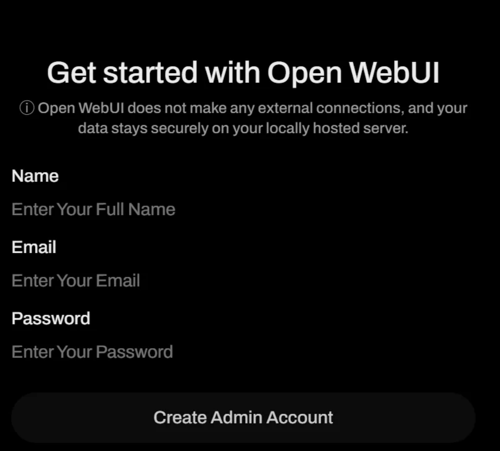
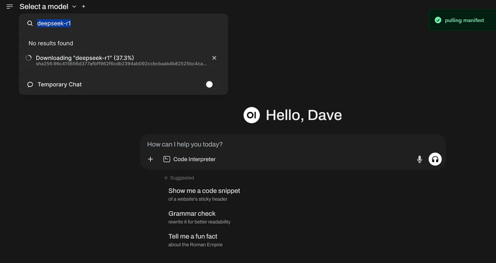
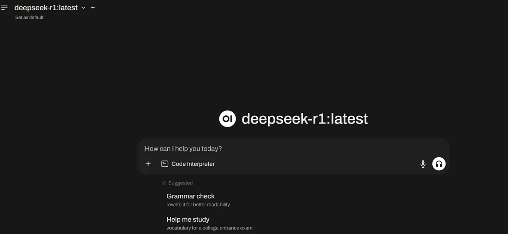

# Deploy Deepseek-r1 on Azure Container Apps

This repo contains a demo for running Deepseek-R1 on Azure Container Apps with Serverless GPUs.

Azure Container Apps is a serverless platform that minimizes infrastructure management. Instead of handling server configurations, container orchestration, and deployment complexities, Container Apps provides the server resources to keep your containerized applications secure and stable.

Azure Container Apps can now be run with serverless GPUs, so you can directly access GPU compute resources without manually configuring infrastructure — just deploy your AI model’s image.

You will get prompted during the AZD deployment step for the region to deploy this scenario. The preferred location is WestUS3.

This scenario can be deployed to Azure using the [Azure Developer CLI - AZD](https://learn.microsoft.com/en-us/azure/developer/azure-developer-cli/overview?WT.mc_id=AZ-MVP-5000671). 

💪 This template scenario is part of the larger **[Microsoft Trainer Demo Deploy Catalog](https://aka.ms/trainer-demo-deploy/?WT.mc_id=AZ-MVP-5000671)**.

## ⬇️ Installation
- [Azure Developer CLI - AZD](https://learn.microsoft.com/en-us/azure/developer/azure-developer-cli/install-azd?WT.mc_id=AZ-MVP-5000671)
    - When installing AZD, the above the following tools will be installed on your machine as well, if not already installed:
        - [GitHub CLI](https://cli.github.com?WT.mc_id=AZ-MVP-5000671)
        - [Bicep CLI](https://learn.microsoft.com/en-us/azure/azure-resource-manager/bicep/install?WT.mc_id=AZ-MVP-5000671)
    - You need Owner or Contributor access permissions to an Azure Subscription to  deploy the scenario.

## 🚀 Deploying the scenario in 3 easy steps:

1. From within a new folder on your machine, run `azd init` to initialize the deployment.
```
azd init -t petender/azd-addsvm
```
2. Next, run `azd up` to trigger an actual deployment.
```
azd up
```
3. If you want to delete the scenario from your Azure subscription, use `azd down`
```
azd down --purge --force
```

⏩ Note: running `azd down` deletes the RG and Resources, but will keep the artifacts on your local machine.

## What is the demo scenario about?


## Deploy Deepseek-r1 on Azure Container Apps 

👉 https://blog.azinsider.net/deploy-deepseek-r1-on-azure-container-apps-using-bicep-language-5f495724959e?source=friends_link&sk=6b78d1553b2edd0cf5115aee1844fe59

An `azd` template (Bicep) for quickly deploying Deepseek-R1 on Azure Container Apps.

### Prerequisites  

Before you can deploy this template, make sure you have the following tools  

- [Azure Developer CLI (azd)](https://learn.microsoft.com/en-us/azure/developer/azure-developer-cli/install-azd)  
  - Installing `azd` also installs the following tools:  
    - [GitHub CLI](https://cli.github.com)  
    - [Bicep CLI](https://learn.microsoft.com/en-us/azure/azure-resource-manager/bicep/install)  
- You need Owner or Contributor permissions on an Azure Subscription to deploy this template.  

### Deployment

Once `azd` is installed on your machine, you can deploy this template using the following steps:

1. Run the `azd init` command in an empty directory with the `--template` parameter to clone this template into the current directory.  

    ```cmd
    azd init --template daverendon/azd-deepseek-r1-on-azure-container-apps
    ```

    When prompted, specify the name of the environment.

1. Run the `azd auth login` command to authenticate to your Azure subscription _(if you haven't already)_.

    ```cmd
    azd auth login
    ```

1. Run the `azd up` command to provision the resources in your Azure subscription. This will deploy both the infrastructure and the sample application. _(Use `azd provision` to only deploy the infrastructure.)_

    ```cmd
    azd up
    ```

    
1. Once the deployment is complete, you can go to the URL of the container app. Then, start setting up the application with Open WebUI. 



Next, under the ‘Select a model’ option, look for DeepSeek-R1 as shown below:



Select DeepSeek-R1



Now you’re ready to start using it!
